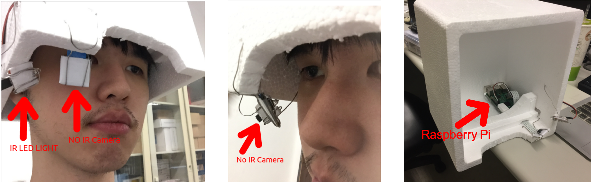
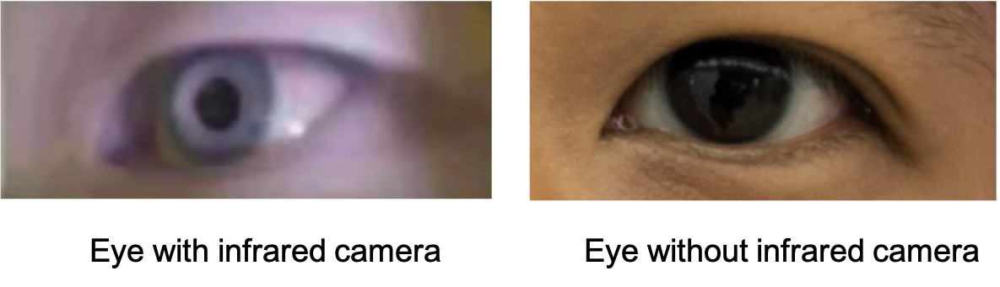
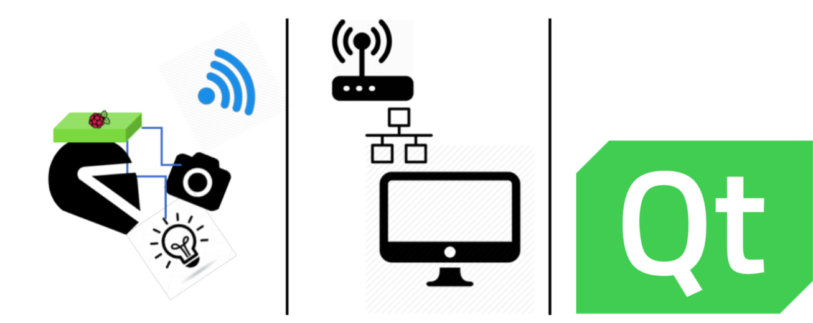

# Smart Guidance Helmet
Eslab final project (2018 Fall) @ National Taiwan University  
Inspired by [YutaItoh/3D-Eye-Tracker](https://github.com/YutaItoh/3D-Eye-Tracker)  
Author: B04901003 許傑盛, B04901059 蔡承佑

## Description
This project aim to use gaze-detection to do something funny and fancy.  

To reproduce this project, you should make a wearable headset which consist of a RPi to connect to internet and under the same subnet of the PC and a IR LED & [Pi NoIR camera V2](https://www.raspberrypi.org/products/pi-noir-camera-v2/) to capture the eye-pupil.



Demonstration video: [Video on Youtube](https://youtu.be/5OHSl7S5Nqg)

### Why using IR
Since Aisan eye compose iris with dark color, it's hard to identify pupil from visible light spectrum. However, in infrared wavelength (~850nm) pupil would absorb the light while iris reflect it.



## Project Structure

+ Raspberry Pi: 
	+ Manipulate edge device : NoIR camera v2, IR LED 
	+ Communication thru internet : ***raspivid + gstreamer***

+ PC (Ubuntu 16.04): 
	+ According to image from camera, calculate the gaze position & correspond target 
	+ Show the information of the target where gaze point 


## How to build
Our source code would seperate into two parts. One is for gaze-capture, and another part is for UI display using QT, all source would written in C++.  
All source would tested on **Ubuntu 16.04**, with **Raspberry Pi3 model B**.

### Prerequisite
#### PC side
+ OpenCV 3.1.0 **with gstreamer enable**  
https://www.pyimagesearch.com/2016/10/24/ubuntu-16-04-how-to-install-opencv/  
\# **Note that opencv should be installed before ceres**

	> 1. dc1394.h not found  
	>         sudo apt install libdc1394-22-dev
	> 2. ceres error  
	>         need to first uninstall that
	> 3. hdf5.h not found  
	>         https://github.com/opencv/opencv/issues/6016
	> 4. ')' must before '>' macro  
	>         https://github.com/opencv/opencv_contrib/issues/618
	> 5. pkg-config -lpipicv  
	>         edit file /usr/local/lib/pkgconfig/opencv.pc
	>         https://askubuntu.com/questions/720528/opencv-compiling-errorippicv
	
+ Boost 1.62.0  
https://www.boost.org/doc/libs/1_62_0/more/getting_started/unix-variants.html

+ eigen 3.2.7  
http://eigen.tuxfamily.org/index.php?title=Main_Page#Download  
	
	```
	$ git clone https://github.com/eigenteam/eigen-git-mirror
	$ git checkout 3.2.7  
	$ mkdir build; cd build  
	$ cmake ..; make
	$ sudo make install
	``` 
	
+ ceres-solver 1.11.0  
http://ceres-solver.org/installation.html

	```
	$ git clone https://ceres-solver.googlesource.com/ceres-solver
	$ git checkout 1.11.0
	<rest follow the website>
	```
+ QT5
+ Gstreamer

#### Raspberry Pi side
+ Gstreamer
+ raspivid (enable camera in rpi)

### Build the project
#### 1. Run gaze tracking
```
(PC) $ git clone https://github.com/NTUEE-ESLab/2018Fall_Smart-Guidance-Helmet.git
(PC) $ cd 2018Fall_Smart-Guidance-Helmet/gaze-tracking
(PC) $ mkdir build; cd build
(PC) $ cmake ..; make
(PC) $ cmake ..; make  # this might happen since it's my first time to write such big project's cmake ...
(PC) $ cd main
(Rpi)$ raspivid -cd MJPEG -w 640 -h 480 -b 9000000 -fps 20 -vf -t 0 -o - | gst-launch-1.0 fdsrc ! jpegparse ! rtpjpegpay ! udpsink host=<PC IP> post=5000
(PC) $ ./main
```
##### Some debug keys are pre-assigned for a better control of the software:

+ ```p```: Takes some more 2D pupil observations. Useful when estimated 3D eye model is incorrect due to not-well-distributed 2D observations
+ ```r```: Resets the 3D eye model and 2D observations and restarts the initialization step
+ ```ESC```: Exit the program

#### 2. Run eye direction UI
```
(PC) $ cd 2018Fall_Smart-Guidance-Helmet/eye-direction-UI
(PC) $ qmake; make
(PC) $ ./eyedirection2
```

## Acknowledgements
+ [Windows base 3D-Eye-Tracker](https://github.com/YutaItoh/3D-Eye-Tracker) by YutaItoh
+ [2D pupil detection code](http://www.jeoresearch.com/research) by Jason Orlosky
+ [3D eye ball algorithm](https://github.com/LeszekSwirski/singleeyefitter) by LeszekSwirski


